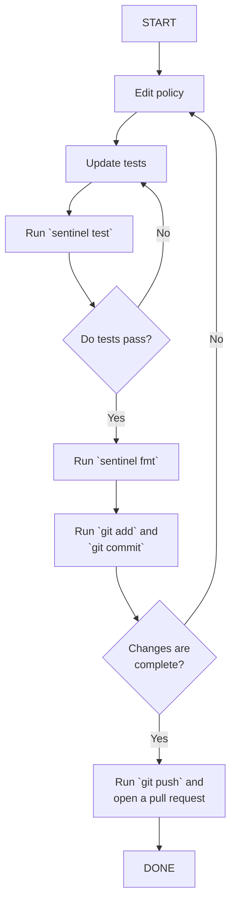

# Sentinel Workflow

## Prerequisites

- **Sentinel CLI**: Install from [developer.hashicorp.com](https://developer.hashicorp.com/sentinel/install).
  Pin your local version to match the Sentinel version embedded in your target Vault
  Enterprise release. Check the [Vault release notes](https://developer.hashicorp.com/vault/docs/updates/release-notes)
  for the embedded Sentinel version.

- **Terraform CLI**: Install from [developer.hashicorp.com/terraform/install](https://developer.hashicorp.com/terraform/install).

- **Vault Enterprise sandbox**: Access to a running Vault Enterprise cluster (not
  Vault Community Edition — Sentinel is an Enterprise feature) with a token that
  has write access to `sys/policies/egp/*` and `sys/policies/rgp/*`.

---

## Local Development Loop

The inner loop for working on any policy:



### Run all tests

```bash
sentinel test policies/
```

### Run tests for a single policy

```bash
sentinel test policies/authorized-engines.egp.sentinel
```

### Verbose output (shows trace for passing tests too)

```bash
sentinel test -verbose policies/
```

---

## Writing a New Policy

### 1. Choose a filename and type

Name the file after its purpose and include the policy type as a second extension:

```
policies/<descriptive-name>.egp.sentinel   # Endpoint Governing Policy
policies/<descriptive-name>.rgp.sentinel   # Role Governing Policy
```

Use kebab-case. The type suffix matters: it determines the test directory name and
communicates to readers whether the policy is path-bound (EGP) or identity-bound
(RGP).

### 2. Understand the difference

|                 | EGP                                             | RGP                                                              |
|-----------------|-------------------------------------------------|------------------------------------------------------------------|
| **Fires on**    | Any request matching a configured URI path glob | Any request by a token carrying the RGP policy name              |
| **Bound to**    | URI paths (configured via Terraform)            | Tokens, Entities, or Groups                                      |
| **Assigned by** | Existing                                        | Being attached to an Entity, Group, or token                     |
| **Can inspect** | `namespace`, `request` globals                  | `namespace`, `request`, `token`, `identity` globals.             |
| **Common use**  | "Block this operation for everyone"             | "Apply this permissions boundary to tokens carrying this policy" |

### 3. Available globals

Vault injects these as globals at runtime. Your policy can reference them directly
without an `import` statement:

| Global                     | Type         | Description |
|----------------------------|--------------|------------------------------------------------------------------------|
| `namespace.id`             | string       | ID of the namespace handling the request                               |
| `namespace.path`           | string       | Path of the namespace (e.g., `""` for root, `"admin/"` for admin)      |
| `request.path`             | string       | Request URI path with leading `/` stripped                             |
| `request.operation`        | string       | Operation type: `"read"`, `"update"`, `"create"`, `"delete"`, `"list"` |
| `request.data`             | map          | Raw request body data                                                  |
| `token.policies`           | list(string) | Policies attached to the requesting token                              |
| `token.entity_id`          | string       | Identity entity ID attached to the token                               |
| `identity.entity.metadata` | map(string)  | Metadata on the entity                                                 |
| `identity.groups.by_name`  | map          | Map of group name → group object                                       |

([Full property reference](https://developer.hashicorp.com/vault/docs/enterprise/sentinel/properties))

### 4. Policy structure

```sentinel
import "strings"

# Constants at the top
EXEMPT_NAMESPACES = ["admin/"]

# Helper functions
is_exempt = func() {
  return namespace.path in EXEMPT_NAMESPACES
}

# Named intermediate rules (optional but improves test diagnostics)
my_condition = rule when <precondition_expression> {
  <boolean expression>
}

# (NOTE: `main` is required and must be a rule)

# <text to show when sentinel blocks an action>
main = rule when <precondition_expression> {
  my_condition or is_exempt()
}
```

Use `rule when <expr>` to guard rules that should only fire on specific operations
or paths. When the `when` condition is false, the rule evaluates to `true` (pass).

---

## Writing Tests

### Directory structure

Tests live alongside the policy files under `policies/test/`:

```
policies/
├── my-policy.egp.sentinel
└── test/
    ├── mocks/                    ← copy-paste reference globals
    └── my-policy.egp/            ← named after policy without .sentinel
        ├── pass-<scenario>.hcl
        └── fail-<scenario>.hcl
```

The Sentinel CLI strips the final `.sentinel` extension when looking for the test
directory: `my-policy.egp.sentinel` → `test/my-policy.egp/`.

### Naming test cases

- `pass-<scenario>.hcl` — policy should pass (`main` = `true`)
- `fail-<scenario>.hcl` — policy should fail (`main` = `false`)

### Basic test case structure

```hcl
# Provide the Vault globals your policy reads
global "namespace" {
  value = {
    id   = "root"
    path = ""
  }
}

global "request" {
  value = {
    path      = "sys/mounts/secret"
    operation = "update"
    data = {
      type = "kv-v2"
    }
  }
}

# Optional: assert specific rule values
# If omitted, the test asserts main = true
test {
  rules = {
    main                    = false
    secrets_engines_allowlist = false
  }
}
```

### Using shared mock reference files

`policies/test/mocks/` contains ready-to-copy `global` blocks for common scenarios.
Copy the relevant block into your test case and adjust as needed:

| File                                | What it provides                                      |
|-------------------------------------|-------------------------------------------------------|
| `namespace-root.hcl`                | `global "namespace"` for root namespace               |
| `namespace-admin.hcl`               | `global "namespace"` for `admin/` namespace           |
| `namespace-child.hcl`               | `global "namespace"` for a non-exempt child namespace |
| `request-mount-secrets-engine.hcl`  | `global "request"` for `sys/mounts/*` update          |
| `request-mount-auth-engine.hcl`     | `global "request"` for `sys/auth/*` update            |
| `request-sentinel-policy-write.hcl` | `global "request"` for `sys/policies/egp/*` write     |
| `request-token-create.hcl`          | `global "request"` for `auth/token/create`            |
| `identity-with-entity.hcl`          | `global "identity"` with entity + group membership    |
| `token-with-entity.hcl`             | `global "token"` with entity binding                  |

> [!note]
>
> The `mock { module { source = "..." } }` pattern only works for explicit `import`
> statements in the policy (e.g., `import "strings"`). Vault's injected globals
> (`namespace`, `request`, `token`, `identity`) must be provided via `global` blocks;
> they cannot be sourced from a module.

### EGP tests -- What to mock

EGP tests focus on `namespace` and `request`:

```hcl
global "namespace" {
  value = { id = "root", path = "" }
}

global "request" {
  value = {
    path      = "sys/mounts/secret"
    operation = "update"
    data      = { type = "kv-v2" }
  }
}
```

Cover at minimum:

- A passing case with valid input
- A failing case with invalid input
- Any exemption paths (e.g., exempt namespace bypasses a restriction)
- `when`-guard bypass (operation or path that doesn't trigger the rule)

### RGP tests -- What to mock

RGP tests focus on `identity` and `token`; `request.path` is not the primary concern:

```hcl
global "identity" {
  value = {
    entity = {
      id       = "entity-abc-123"
      name     = "example-entity"
      metadata = { "team" = "platform" }
      policies = []
      aliases  = []
      merged_entity_ids = []
    }
    groups = {
      by_id   = {}
      by_name = {}
    }
  }
}

global "token" {
  value = {
    entity_id = "entity-abc-123"
    type      = "service"
    policies  = ["platform-admin"]
  }
}
```

---

## Deploying to Sandbox

The `examples/terraform/` directory contains a Terraform configuration that deploys
all policies to a Vault Enterprise cluster.

### 1. Initialize Terraform

```bash
cd examples/terraform
terraform init
```

### 2. Set variables

```bash
export VAULT_ADDR="https://vault-sandbox.example.com:8200"
export VAULT_TOKEN="<sandbox-vault-token>"
export TF_VAR_enforcement_level="soft-mandatory"
```

Use `soft-mandatory` in sandbox so policies can be overridden while you're validating
behavior. This also lets you test the `X-Vault-Policy-Override: true` header flow.

### 3. Preview the changes

```bash
terraform plan
```

### 4. Apply

```bash
terraform apply
```

### 5. Verify

```bash
# Confirm policies are present
vault list sys/policies/acl  # lists ACL policies
vault list sys/policies/egp  # lists Sentinel EGPs
vault list sys/policies/rgp  # lists Sentinel RGPs

vault read sys/policies/egp/authorized-engines
vault read sys/policies/egp/no-entityless-tokens
vault read sys/policies/egp/authorized-sentinel-only
```

---

## Promoting to Production

Policy changes follow a PR-based promotion flow. No direct `terraform apply` to
production is permitted outside this flow.

```
┌─────────────────────────────────────────────────────────────────┐
│  1. Open PR                                                     │
│     └─ CI: sentinel test  ← blocks merge if any test fails      │
│     └─ CI: terraform plan (sandbox)  ← visible in PR            │
└───────────────────────────────┬─────────────────────────────────┘
                                │ PR approved + merged to main
┌───────────────────────────────▼─────────────────────────────────┐
│  2. Merge to main                                               │
│     └─ CI: terraform apply → sandbox (auto)                     │
└───────────────────────────────┬─────────────────────────────────┘
                                │ sandbox apply succeeds
┌───────────────────────────────▼─────────────────────────────────┐
│  3. Production approval gate                                    │
│     └─ GitHub Actions "production" environment requires review  │
│     └─ Authorized reviewer approves in GitHub Actions UI        │
│     └─ CI: terraform apply → production (enforcement_level:     │
│           hard-mandatory)                                       │
└─────────────────────────────────────────────────────────────────┘
```

### GitHub Actions environment setup (one-time)

1. Go to **Settings → Environments → New environment** in GitHub
2. Name it `production`
3. Add required reviewers (platform admins)
4. The `terraform-apply-production` job in `.github/workflows/sentinel-test.yml`
   will pause at this gate

### Required repository secrets

| Secret                | Used by                                             |
|-----------------------|-----------------------------------------------------|
| `SANDBOX_VAULT_ADDR`  | `terraform-plan-sandbox`, `terraform-apply-sandbox` |
| `SANDBOX_VAULT_TOKEN` | `terraform-plan-sandbox`, `terraform-apply-sandbox` |
| `PROD_VAULT_ADDR`     | `terraform-apply-production`                        |
| `PROD_VAULT_TOKEN`    | `terraform-apply-production`                        |

---

## Policy Type Reference

|                             | ACL                                                  | EGP                                                  | RGP                                                                               |
|-----------------------------|------------------------------------------------------|------------------------------------------------------|-----------------------------------------------------------------------------------|
| **Requires Enterprise?**    | No                                                   | Yes                                                  | Yes                                                                               |
| **Fires on**                | Requests by tokens/entities carrying the policy      | All requests matching a URI path glob                | All authenticated requests, specifically by tokens/entities carrying the policy   |
| **Bound to**                | Tokens, entities, groups                             | URI path globs (configured at deploy)                | Tokens, Entities, Groups (assigned by name, same as ACL)                          |
| **Can use Sentinel logic?** | No                                                   | Yes                                                  | Yes                                                                               |
| **Performance**             | Fastest                                              | Slowest (runs on every matching request)             | Slow (runs on every request for carrying tokens)                                  |
| **Typical use**             | Access control ("can this identity read this path?") | Platform governance ("nobody can do X at this path") | Identity-based permissions boundaries ("entities with metadata Y must satisfy Z") |

**Start with ACL.** Only reach for EGP or RGP when the ACL system cannot express
what you need. The performance cost of Sentinel is significant; every millisecond
added to Vault's response time affects all callers.

See [README.md](./README.md) for additional guidance on choosing the right policy
type.
